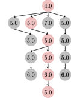

**PlotSearchTree.jl**
is a simple convenience package to visualize the search tree of Forward search algorithm produced by [SymbolicPlanners.jl](https://github.com/JuliaPlanners/SymbolicPlanners.jl) as follows:



The above figure was create as follows:
```julia
using Test, Random
using PDDL, PlanningDomains
using SymbolicPlanners
using PlotSearchTree 


domain = load_domain(Symbol("wolf-goat-cabbage"))
problem = load_problem(Symbol("wolf-goat-cabbage"), "problem-1")
state = initstate(domain, problem)
spec = Specification(problem)

h = EvalTracker(HAdd())
planner = AStarPlanner(h;save_search = true)
sol = planner(domain, state, spec)

plot_search_tree("goat.tex", sol, h)
```
You can see that it follows the standard SymbolicPlanners use with the exception of heuristic being wrapped to `EvalTracker` to log its values and order at which states were evaluated. The plot is than created by `plot_search_tree`. The output is a tikz figure, which needs to be compiled manually using for example pdflatex. See help for little available options.

See [example/example.jl](example/example.jl) for a script with an example on blocksworld.